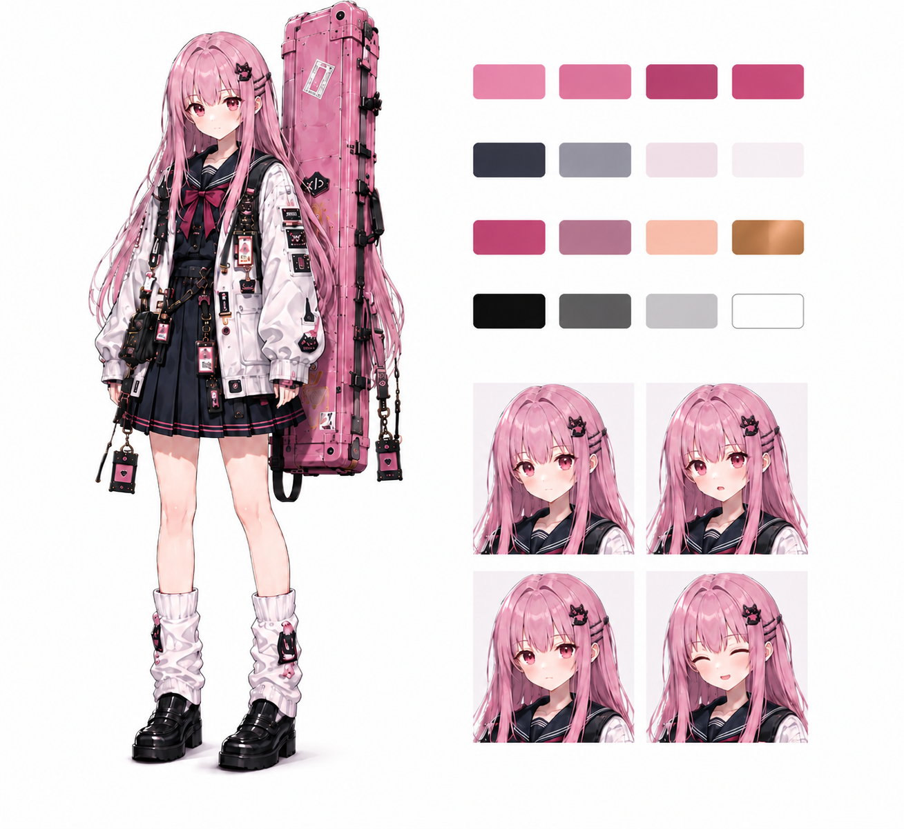
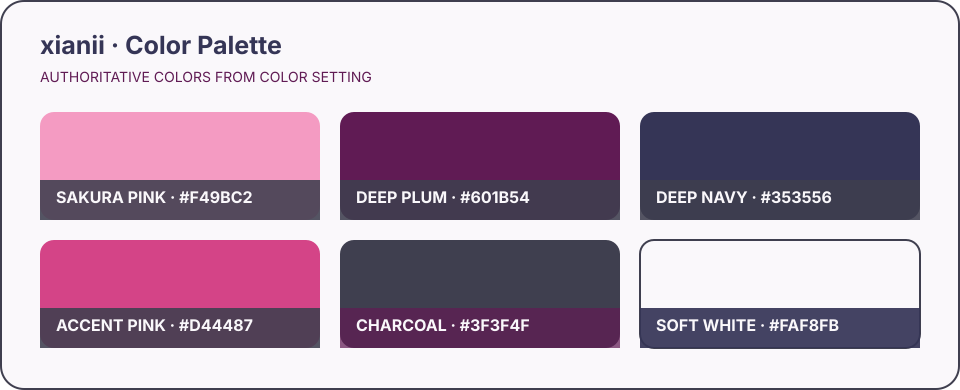

# xianii

> 原创角色（Original Character / OC）设定档案

本仓库用于整理和展示原创角色 **xianii** 的人物设定。角色名称、形象、世界观设定及仓库内相关素材均受著作权及其他适用法律保护；使用前请阅读 [使用许可](./LICENSE.md)。

## 角色参考图



> **参考图说明：** 本图由 AI 生成，仅用于展示角色的整体轮廓、配色、服装层次、长箱及表情方向。图中可能存在结构错误、细节不一致和生成瑕疵，不作为机械结构、配件数量或文字内容的定稿依据；发生冲突时，以本文档中的文字设定为准。

## 基本信息

| 项目 | 设定 |
| --- | --- |
| 人物名 | xianii |
| 身高 | 158 cm |
| 身份印象 | 全栈工程师 |
| 发色 | 粉色 |
| 发型 | 齐胸长直发，齐刘海 |
| 瞳色 | 棕色偏红 |

## 设计关键词

`粉黑配色` · `JK 制服` · `工程师` · `电子元件` · `代码符号` · `精密测量` · `重型武器`

xianii 的整体设计围绕“精密与力量的反差”展开：人物身形轻巧、气质安静，视觉元素偏向精密电子与软件工程；武器则尺寸夸张，强调机械重量感。日常状态应保留亲和、细致的工程师印象，进入战斗后则突出果断、专注和带电武器的压迫感。

## 外观与配色



> 色板从旧版 AI 设定图中提炼，用于统一后续绘制的视觉方向，并非对原图像素的精确采样。正式立绘完成后可再校准色值。

- **主色**：柔和的樱粉色，用于头发、武器箱和视觉识别元素。
- **基础色**：深黑、炭灰和深海军蓝，用于制服、鞋履及机械结构。
- **辅助色**：低饱和的浅灰白，用于宽松外套，平衡大面积深色。
- **效果色**：偏粉紫的电弧光，用于武器启动及攻击效果。
- **金属色**：银灰色，用于游标卡尺主体、扣件和电子零件。

整体应避免高饱和、多色块堆叠。电子元件、走线、代码符号和铭牌适合作为局部细节，不应掩盖“粉发、浅色外套、深色制服、粉色长箱”这一核心轮廓。

## 服装

- **内搭**：深色水手领 JK 制服，搭配膝上百褶裙；领巾可使用暗粉或灰粉色，与头发形成呼应。
- **外套**：浅灰白色宽松长袖工程外套，长度略过胯，袖口自然堆叠。外套可装饰少量 PCB、代码符号、元件图标和功能标签。
- **腿部**：浅色小腿袜或堆堆袜，与深色裙装和鞋履形成明暗分区。
- **鞋履**：黑色制服鞋，鞋底略厚，以支撑背负大型武器箱的视觉重量。
- **随身挂件**：工牌、数据线、小型电路板、工具或电子元件可作为可替换配件，但不要求每次绘制全部出现。

## 武器设定

xianii 使用一把巨大的游标卡尺作为武器。卡尺主体保留外测量爪、内测量爪、主尺、游标、锁紧结构和深度杆等辨识特征，同时加入绝缘握把与供能结构。平时收纳在约 1.2 米高的粉色硬质乐器箱中，并背负于身后。

武器可以切换为多种形态：

- **未展开｜重锤形态**：测量爪闭合，利用卡尺主体的重量进行双手挥击，使用方式类似双手大锤。
- **深度杆完全展开｜巨剑形态**：手握经过强化及绝缘处理的深度杆；展开时，两个测量爪之间产生粉紫色电弧，使挥砍附带电击效果。
- **深度杆部分展开｜发射器形态**：
  - 霰弹枪模式：发射外形类似贴片电阻的霰弹。
  - 榴弹模式：发射外形类似直插电解电容的榴弹。
  - 狙击枪模式：发射外形类似色环电阻的子弹。

武器的核心识别点是“巨型游标卡尺”，不能简化成普通长剑、枪械或锤子。无论处于何种形态，都应保留可辨认的卡尺主尺和测量爪。

### 携行与战斗表现

- 非战斗时，武器完全收纳于粉色硬质长箱内；箱体可带有 `xianii` 铭牌、代码符号及少量贴纸。
- 长箱以双肩背负或专用背带固定，不应仅靠单个装饰挂件承重。
- 进入战斗时，人物采用降低重心的双手持握姿态，以体现武器的尺寸和重量。
- 电弧仅在武器启动、形态切换或攻击时出现，避免长期放电削弱机械结构的可读性。

## 饰品

- **色环电阻手链**：由色环电阻串成，电阻色环值以 ASCII 编码表示名字 `xianii`。
- **PCB 发夹**：使用 PCB 制作，具有迷你摄像头和麦克风，是随身携带的 AI 助理的眼睛和耳朵。
- **章鱼玩偶**：挂在包上的 GitHub 章鱼玩偶。

## 神态与气质

- **默认**：安静、自然，略带观察感。
- **微笑**：克制而友好，不强调夸张表演。
- **专注**：视线明确，适合调试设备、编程或瞄准时使用。
- **开心**：可以更活泼，但仍保持人物原有的温和气质。
- **战斗**：冷静、果断，姿态重心稳定；不以嗜血、疯狂或施虐为表现方向。

## 绘制规范

以下项目构成角色的主要视觉识别，正式绘制时应优先保持一致：

1. 粉色齐胸长直发与齐刘海；
2. 棕色偏红的眼睛；
3. 深色 JK 制服、浅色宽松外套与黑色制服鞋；
4. 作为随身 AI 助理感知端的 PCB 发夹；
5. 粉色硬质长箱；
6. 具有完整卡尺辨识特征的巨型游标卡尺；
7. 粉紫色电弧效果。

### 旧版 AI 参考图说明

现有设定图由 AI 生成，仅用于传达整体配色、服装层次、角色气质和设计方向，**不作为精确结构或文字内容的定稿依据**。参考该图进行重绘时，请注意：

- 图中的乱码、错误文字、随机徽标及无法辨认的电子元件不属于正式设定；
- 卡尺刻度、测量爪方向、深度杆、握把、供能结构和机械连接关系需要重新合理设计；
- 三视图、战斗图和武器分解图中的配件数量、服装细节及结构存在不一致，应以本文档为准；
- 长箱必须能够合理容纳并固定收拢后的武器，其尺寸、开合方向和背负结构需要统一；
- 未在本文档确认的挂件和装饰均视为可替换视觉元素，而非角色必备特征。

后续若制作正式设定图，建议分别提供角色三视图、服装拆分、核心配件、武器三种形态、收纳结构及标准色板，以减少不同画面之间的结构漂移。

## 使用须知

本角色并非开放版权素材。以下为简要说明，完整且具有约束力的条款以 [LICENSE.md](./LICENSE.md) 为准：

- 商业使用必须事先取得作者明确的书面授权。
- 禁止转载、重新上传、重新分发或以素材包等形式二次发布。
- 禁止用于 R18、色情、暴力、血腥、猎奇、政治、宗教及其他可能引起不适或违反公序良俗的内容。
- 禁止冒充作者、角色权利人或官方账号，亦不得使他人产生相关误解。
- 经许可使用时，必须在显著位置注明借物表、作者和本仓库链接。

推荐的借物表格式：

```text
角色：xianii
原作 / 角色设计：xianii
来源：https://github.com/xianii/OC-xianii
使用性质：非官方二次创作，与原作者无隶属或背书关系
```

> 若仓库地址或作者署名发生变化，请以本仓库最新说明为准。

## 免责声明

任何经许可的二次创作或使用均不代表作者对相关内容、观点、产品或活动的认可、赞助或背书。使用者应自行确保其行为符合法律法规、平台规则和许可条款，并独立承担由此产生的全部责任。详见 [LICENSE.md](./LICENSE.md)。

## 授权咨询

如需商业使用、超出许可范围使用，或无法确定某种用途是否允许，请通过本仓库的 Issue 或作者公开提供的联系方式事先咨询，并在取得明确书面授权后再使用。
